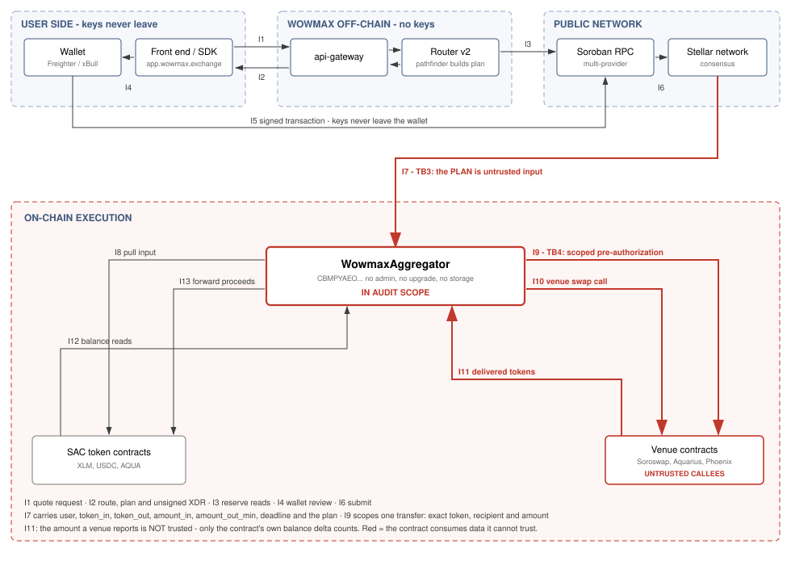
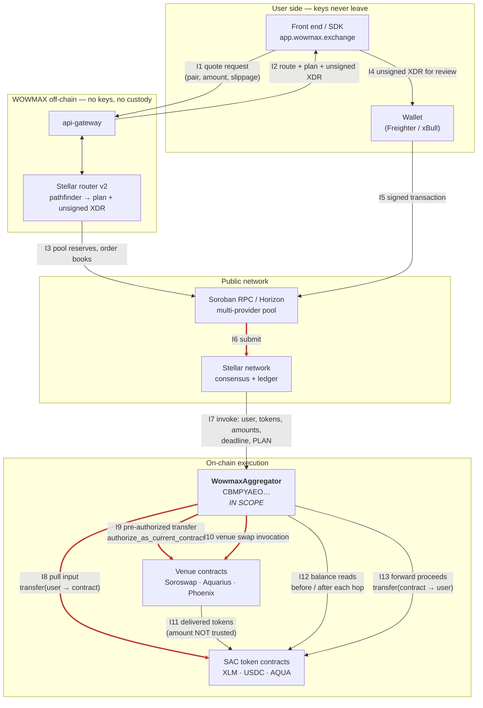

# Dataflow Diagram — WOWMAX Stellar Execution Contract

Companion to [THREAT-MODEL.md](THREAT-MODEL.md). This document defines the
system under review, the entities that exchange data, the trust boundaries
they sit behind, and every interaction that crosses one. The STRIDE analysis
in the threat model is derived from the numbered interactions below.

**Audit scope.** The contract `WowmaxAggregator`, crate
`wowmax-stellar-router`, deployed on Stellar mainnet as
`CBMPYAEOGQUJ3LVMFXPN3X4GVNPPEI6FVG6YC7HYBYSN26KODOLUSNPF`
(wasm sha256 `095ee35248f9076fb76d26d7d97e1308c35586df364ff0442b664c5fb3718883`),
exposing six entry points: `swap`, `swap_soroswap`, `swap_aqua`,
`swap_phoenix`, `swap_aqua_then_soroswap`, `swap_merge`. The contract has no
admin function and no upgrade path; replacement is by redeployment.

Explicitly **out of scope**, and why:

| Component | Why out of scope |
|---|---|
| `contracts/adapters/*` | Not wired into the deployed executor and not deployed on mainnet. |
| `contracts/deployer` | Not present in `public/mainnet.contracts.json`; helper code originating from `stellar/soroban-examples`. |
| Off-chain pathfinder (VFalgo) | Proprietary, off-chain, produces route plans. The contract treats its output as untrusted input (see TB3) — so the pathfinder's correctness is not a security dependency of the contract. |
| Stellar router v2, bridge-aggregator, api-gateway | Off-chain services. Non-custodial: they never hold keys, sign, or broadcast. |
| Classic SDEX path (`PathPaymentStrictSend`) | Executed at protocol level, not through this contract. |

---

## 1. Entities

**External actors**

* **User** — holds the Stellar account keys, signs transactions locally in a
  wallet (Freighter, xBull, and others via the wallets kit). Never delegates
  signing.
* **Integrator** — a third party calling the public API or `@wowmax/sdk`
  instead of the WOWMAX front end. Same trust position as the user.

**WOWMAX off-chain processes** (no keys, no custody)

* **Front end / SDK** — builds the quote request, renders the route, hands
  the unsigned transaction to the wallet.
* **api-gateway** — the single public HTTP surface.
* **Stellar router v2** — computes the route with the off-chain pathfinder
  and emits the **plan** plus an unsigned transaction envelope (XDR).

**On-chain, in scope**

* **Executor contract** — `WowmaxAggregator`. Holds no state between calls,
  has no admin, no upgrade path, and no storage of user funds by design.

**On-chain, external and untrusted**

* **SAC token contracts** — XLM, USDC, AQUA and any other Stellar Asset
  Contract named by a plan.
* **Venue contracts** — Soroswap router and pairs, Aquarius router and
  pools, Phoenix pools. Called by the executor; not controlled by WOWMAX.

**Network infrastructure**

* **Soroban RPC / Horizon providers** — multi-provider pool used for reads,
  simulation and submission.
* **Stellar network** — consensus, ledger state, transaction inclusion.

---

## 2. Trust boundaries

| ID | Boundary | What changes across it |
|---|---|---|
| **TB1** | User device / wallet ↔ WOWMAX off-chain services | Keys and signing authority stay on the user side. Everything WOWMAX returns is unsigned and must be verifiable by the user before signing. |
| **TB2** | WOWMAX off-chain services ↔ public network (RPC, Horizon) | Data leaves controlled infrastructure. Responses are third-party data; the network is a public, adversarial medium (observable mempool-equivalent, reorder/censor by inclusion). |
| **TB3** | Transaction input ↔ executor contract | **The plan is untrusted input.** Although the plan is normally produced by the WOWMAX pathfinder, nothing on-chain proves it. Anyone can call the contract directly with an arbitrary plan. The contract must be safe for *any* plan an attacker can construct. |
| **TB4** | Executor contract ↔ venue contracts | The executor invokes contracts it does not control and cannot audit at call time. A venue may under-consume, over-report, deliver unexpected assets, or reenter. |
| **TB5** | Executor contract ↔ SAC token contracts | Balances and transfers are read from and performed by contracts named in the plan; a plan may name an attacker-controlled "token". |

---

## 3. Diagram

Diagram source (Mermaid) — edit this and re-export <code>dataflow.svg</code> to keep the two in step

Red edges cross **TB3** and **TB4** — the two boundaries where the contract
consumes data it cannot trust. They carry the bulk of the threat model.

---

## 4. Interactions crossing a boundary

| ID | From → To | Data | Boundary | Trusted? |
|---|---|---|---|---|
| I1 | Front end → api-gateway | pair, amount, slippage tolerance, user address | TB1 | n/a (user's own request) |
| I2 | api-gateway → front end | ranked route, plan structure, unsigned XDR | TB1 | User must be able to verify before signing |
| I3 | Router v2 → RPC | reserve and order-book reads | TB2 | Third-party response; stale or wrong data degrades quote quality only |
| I4 | Front end → wallet | unsigned transaction envelope | TB1 | Wallet displays; user authorizes |
| I5 | Wallet → RPC | signed transaction | TB1/TB2 | Signature produced locally |
| I6 | RPC → network | submission | TB2 | Public; inclusion timing not controlled |
| I7 | Network → executor | `user`, `token_in`, `token_out`, `amount_in`, `amount_out_min`, `deadline`, plan (`Vec<Strand>` or `Vec<Stage>`) | **TB3** | **No.** Arbitrary; attacker-constructible |
| I8 | Executor → SAC | `transfer(user → contract, amount_in)` | TB5 | Requires `user.require_auth()` |
| I9 | Executor → venue | `InvokerContractAuthEntry` scoping one transfer: token, recipient, exact amount | **TB4** | Authorization is granted, not assumed — scope is the security control |
| I10 | Executor → venue | swap invocation with venue-specific arguments from the plan | **TB4** | **No.** Callee is external code |
| I11 | Venue → SAC → executor | delivered `token_out` (and any unsolicited asset) | **TB4** | **No.** Reported amount is ignored; only balance delta counts |
| I12 | Executor → SAC | `balance(contract)` before and after every hop and fill | TB5 | Measurement basis for all accounting |
| I13 | Executor → SAC | `transfer(contract → user, actual_out)` | TB5 | Final settlement |

---

## 5. Data entities

| Entity | Sensitivity | Where it lives |
|---|---|---|
| Private key / signature | Critical | User device only. Never transits WOWMAX infrastructure. |
| Plan (`Vec<Strand>` / `Vec<Stage>`) | Integrity-critical, not confidential | Transaction argument; public on-ledger |
| `amount_out_min`, `deadline` | Integrity-critical — the user's only economic guarantees | Transaction argument; enforced on-chain |
| Token balances of the executor | Integrity-critical | SAC contracts; read live, never cached in contract storage |
| Pre-authorization entries | Integrity-critical — the cap on what a venue may take | Constructed per hop inside the call; not persisted |
| Quote / route metadata | Low | Off-chain services; public on-ledger after execution |

Note the absence of a persistent-state entity: the executor keeps **no
contract storage** — no admin address, no configuration, no balances carried
between calls. Every value it acts on is either a call argument or a live
balance read. This removes an entire class of storage-tampering and
state-archival concerns from the analysis.

---

## 6. Assumptions

1. The user's wallet correctly displays and signs what it is given; wallet
   compromise is outside this model.
2. Stellar consensus and the Soroban host behave per specification;
   protocol-level failures are outside this model.
3. Venue contracts are **not** assumed honest. They may misreport,
   under-consume, deliver unexpected assets, or be entirely
   attacker-controlled if named by a plan.
4. The off-chain pathfinder is **not** a security dependency: the contract
   must be safe under any plan, including plans it never produced.
